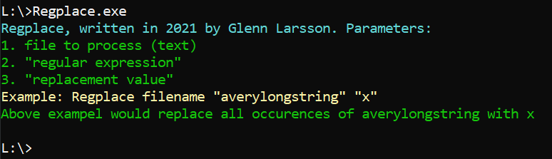

# Regplace

Replace with pattern regexp. Bulk processing of logs.

# Examples:

*Anonymize specific ips*
	Regplace.exe f.txt "\|100.64." "|x.x." 

*Remove part of string*
	Regplace.exe f.txt ",[0-9]{6}" "" 
